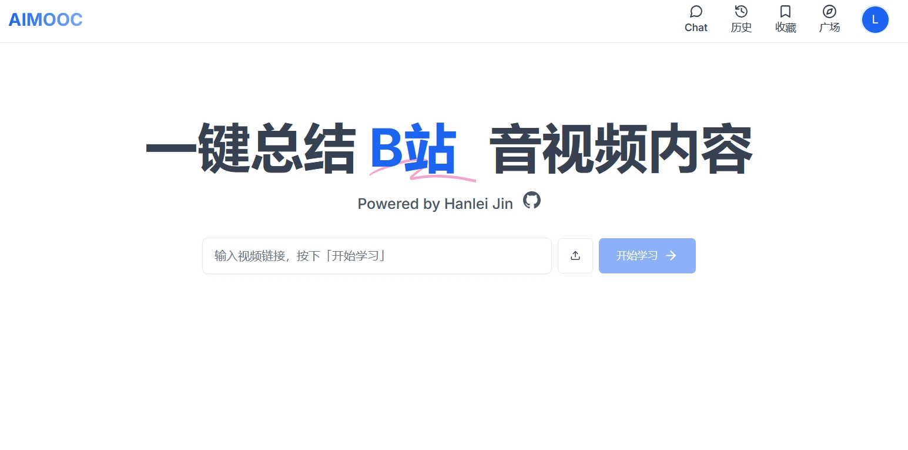

# AIMOOC——AI 驱动的互动式在线学习平台

初衷是觉得现在的在线学习平台太不智能了，学习起来很费劲，现在有这么强大的 AI 技术，为什么不利用起来呢？所以自己写了一个。但是本人能力有限，也没有经过专业的前后端工程实践，都是自己瞎琢磨的，所以肯定有很多不足之处，希望各位大佬多指教。

项目完全实现本地化。
前端：本仓库，基于 React 和 NextJS。
后端：基于 python-FASTAPI[AIMOOC_API](https://github.com/JinHanLei/AIMOOC_API)，更适合开发深度学习套件。
数据库：[supabase](https://supabase.com)负责用户验证和课程相关信息；[upstash](https://upstash.com)负责聊天记录等。

界面如下：




# Quick Start

```bash
git clone https://github.com/JinHanLei/AIMOOC.git
cd AIMOOC
npm install
npm run dev
```

# 亮点：

## 🌟 全阶段学习支持

### 学前准备

- 自动生成视频核心知识点概要
- 时间戳精确定位，按需选择学习内容

### 学习过程

- AI 智能助教实时问答
- 基于视频内容的上下文理解
- 结合知识图谱和网络搜索的全面解答

### 学后巩固

- 智能题目生成和 AI 批改
- 根据学习历史和知识掌握度评估提供个性化复习建议

# TODO：

## 智能推荐系统

### 学习路径生成

- 根据用户学习历史生成个性化学习路线
- 阶梯式课程规划和目标导向的内容推荐

### 个性化视频推荐

- 基于用户学习历史的智能匹配
- 兴趣偏好分析和相关课程智能推荐

## 和谐的在线教育社区

- 人人都是老师，人人都是学生
- 更简易的课程制作工具：
  - 快速生成课程大纲、内容、PPT 等
  - 甚至不需要出镜，利用声音克隆+唇语同步实现自动课程生成。
  - 老师只需要尽到校对的责任
- 更易于变现的教育系统
  - AI 助教 24 小时在线，对于学生反馈 AI 无法解答的问题再进行老师答疑
  - 学生间更自由的交流讨论，获得积分
